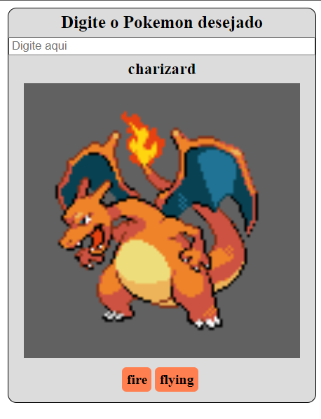

# Creating a Search Pokemon using Angular

## A fully functional EXAMPLE project written in Angular showing how to work with HTTP requisitions

This project is an example that was built along with an  Bootcamp offered by digital innovation one (DIO) showing how to consume a HTTP requisition using Angular.

      

## How to tweak this project for your own uses
Since this is an example project, I´d encourage you to clone and rename this project to use for your own purposes.

## 📖 Useful links
- [Bootcamp offered by DIO] (https://web.dio.me/track/7a55c727-bb2a-42a7-831b-6c38b4e83868)

-[Working Buzzfeed] (https://lucas-gualberto94.github.io/angular-pokemon/)

## Find a bug?
If you found an issue or would like to submit an improvement to this project, please submit an issue using the issue tab above. If you would like to submit a PR with a fix, reference the issue you created! 

## Known issues (work in progress)
This Search Pokemon is till ongoing. There are lots of information and customization that have not been completed yet. This is coming soon!
